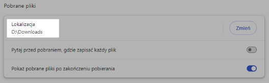
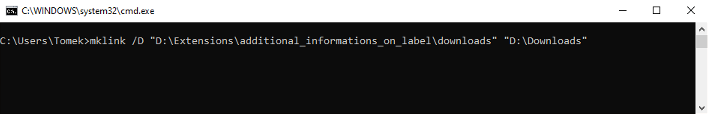
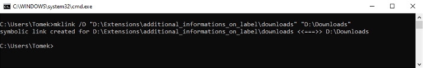
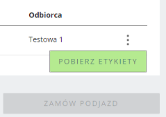
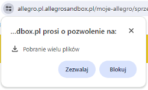

## Dodatkowe pola na wydruku etykiety nadawanej przez WzA
To rozszerzenie pozwala na wydruk pól "Dodatkowa informacja na etykiecie" i "Numer referencyjny" na etykiecie przewoźnika UPS przy nadawaniu przesyłek Allegro One Box i Allegro One Punkt przez "Wysyłam z Allegro". Dodatkowo pozwala na powiększenie czcionki w polu "Uwagi nadawcy" na etykietach przewoźnika One Kurier która normalnie jest bardzo mała.

Osobiście nie mam potrzeby korzystania z tego rozwiązania gdyż generuję etykiety pojedynczo w momencie szykowania paczki, jednak zdaję sobie sprawę że niektórym może się to przydać gdyż zgłaszali takie zapotrzebowanie na forum Allegro Gadane.

Jest to rozszerzenie do przeglądarki Chrome. Wszystkie rozszerzenia testuję tylko dla systemu Windows 10 i najnowszej wersji przeglądarki.

**Instrukcja instalacji:**
1. Pobierz rozszerzenie "additional_informations_on_label.zip" z listy plików widocznej powyżej i rozpakuj je tam gdzie zamierzasz je trzymać.
2. Kliknij ikonę menu rozszerzeń w prawym górnym rogu okna przeglądarki (ikona puzzla)

lub z menu przeglądarki wybierz "Rozszerzenia - Zarządzaj rozszerzeniami".
3. Włącz "Tryb dewelopera" w prawym górnym rogu okna przeglądarki

4. Kliknij przycisk "Załaduj rozpakowane" 

5. Wybierz folder z uprzednio pobranym i rozpakowanym rozszerzeniem.
6. Z menu przeglądarki wybierz "Ustawienia - Pobrane pliki" i zapamiętaj lub zaznacz i skopiuj lokalizację. Zrób to w tym miejscu ponieważ nazwa folderu wyświetlana w oknie "Mój komputer" nie musi być taka sama jak rzeczywista nazwa folderu na dysku, np. folder może wyświetlać się jako "Pobrane", ale jego rzeczywista nazwa to "Downloads" 

7. Aby rozszerzenie mogło widzieć pliki pobranych etykiet wymagane jest utworzenie tzw. dowiązania symbolicznego (to coś podobnego do skrótu). W tym celu otwórz wiersz polecenia (wciśnij klawisze <kbd>Win</kbd> + <kbd>R</kbd> wpisz <code>cmd</code>, kliknij OK lub wciśnij Enter albo kliknij Menu Start, wpisz <code>cmd</code> lub <code>wiersz polecenia</code>, kliknij uruchom lub wciśnij Enter). Następnie wpisz (zachowując znaki cudzysłowiu):  
<samp>mklink /D "ścieżka folderu rozszerzenia\downloads" "lokalizacja pobieranych plików"</samp>  
 

8. System potwierdzi utworzenie dowiązania symbolicznego 
 
Gdy wejdziesz teraz do folderu "downloads" znajdującego się w folderze rozszerzenia, powinieneś zobaczyć zawartość folderu do którego przeglądarka domyślnie pobiera pliki.

To już wszystko. Etykiety które będą przetwarzane przez to rozszerzenie będą sygnalizowane przez zielony przycisk "Pobierz etykiety" 

Etykiety są przetwarzane tylko w momencie pobierania na stronie od razu po zamówieniu przesyłki. Ponownie pobierane etykiety np. ze strony Sprzedaż - Obsługa zamówień - Zamówione przesyłki nie są przetwarzane. Nadawanie grupowe nie jest obsługiwane - przesyłki trzeba zamawiać pojedynczo.

Przy pierwszym pobieraniu przeglądarka zapyta jeszcze o pozwolenie na pobieranie wielu plików (jest to spowodowane tym że rozszerzenie od razu po pobraniu etykiety przerabia ją, usuwa pobraną etykietę i zapisuje gotowy plik pod tą samą nazwą). Należy kliknąć "Zezwalaj" 
 

Rozszerzenie możesz sprawdzić w serwisie testowym [Allegro Sandbox](https://developer.allegro.pl/tutorials/informacje-podstawowe-b21569boAI1#srodowisko-testowe) przy czym etykiety UPS Allegro One Box i Allegro One Punkt tam generowane nie mają poprawnego wyglądu - składają się tylko z rozciągniętego na całą stronę kodu kreskowego, jednak zobaczysz nadruk zawartości pól na etykiecie w odpowiednim miejscu. 
***
Jeżeli napotkasz jakieś błędy w trakcie działania aplikacji, masz jakieś pytania, sugestie, problemy z obsługą, daj znać w sekcji "Discussions".
Jeżeli podoba Ci się moja praca i chcesz aby była dalej rozwijana, możesz wesprzeć mnie dotacją na dowolną kwotę przez PayPal (nie ma potrzeby posiadania konta PayPal): [przekaż donację](https://www.paypal.com/donate/?hosted_button_id=GVU3UC2ZY85SN&locale.x=pl_PL)
